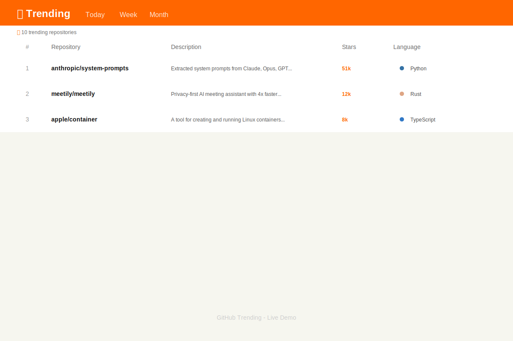

# GitHub Trending

[](https://gadathegod.github.io/GithubTrending/)


A sleek, Hacker News-inspired static site that displays trending GitHub repositories with real-time data, updated daily via GitHub Actions.



## ✨ Features

- **🔥 Trending Repositories** — Discover what's hot on GitHub across Today, Weekly, and Monthly periods
- **🔍 Instant Search** — Filter repositories by name, description, or language
- **🌐 Language Filter** — Auto-populated dropdown to find repos in your preferred language
- **📊 Stats Dashboard** — Real-time repository count and last updated timestamp
- **🎨 Clean Table Layout** — CSS Grid-based responsive design with language-colored dots
- **📱 Fully Responsive** — Optimized for desktop, tablet, and mobile viewports
- **⚡ Zero Dependencies** — Pure HTML, CSS, and JavaScript — no frameworks required
- **🔄 Auto-Updated** — GitHub Action scrapes fresh data daily without manual intervention

## 🚀 Live Demo

Visit the live site: **[gadathegod.github.io/GithubTrending](https://gadathegod.github.io/GithubTrending/)**

## 📁 Project Structure

```
.github/workflows/    GitHub Actions workflows (daily scraper)
assets/               Screenshots and static assets
css/                  Stylesheets
data/                 Scraped trending data (updated by CI)
js/                   Application JavaScript
scripts/              Scraper and utility scripts
tests/                Jest test suite (47 tests)
index.html            Main site entry point
package.json          Dependencies and scripts
README.md             This file
```

## 🛠️ Local Development

### Prerequisites

- Node.js 18+ (for the scraper)
- Any modern web browser

### Installation

```bash
npm install
```

### Running the Scraper

```bash
npm run scrape
```

This fetches trending repos from GitHub and updates `data/trending.json`.

### Running Tests

```bash
npm test
```

Runs 47 Jest tests covering:
- Star count parsing (k/m/commas)
- HTML extraction from GitHub trending
- URL construction for time filters
- Data format validation
- Filter logic (search, language, sort)
- DOM rendering

### Serving the Site

```bash
npx serve .
```

Or simply open `index.html` in your browser.

## 📸 Screenshots


## 🚀 Deployment

### GitHub Pages (Recommended)

1. Push this repository to GitHub
2. Go to **Settings > Pages**
3. Select **Deploy from a branch** → `main` branch, `/ (root)` folder
4. Save — your site will be live in ~2 minutes

The site is automatically deployed at: `https://yourusername.github.io/GithubTrending`

### How It Works

1. **GitHub Action** (`.github/workflows/update-trending.yml`) runs daily at 08:00 UTC
2. Scrapes `github.com/trending` for Today, Weekly, and Monthly data
3. Extracts repo names, descriptions, star counts, and languages
4. Saves results to `data/trending.json` and commits to the repo
5. GitHub Pages serves the static site automatically

### Manual Trigger

Run the workflow manually from the **Actions** tab without waiting for the schedule.

## 🧪 Testing

| Test Suite | Coverage |
|---|---|
| `parseStars.test.js` | Star count parsing (k, m, commas, plain numbers) |
| `extractRepos.test.js` | HTML parsing — name, description, stars, language, URL |
| `timeFilters.test.js` | URL construction for daily/weekly/monthly filters |
| `dataFormat.test.js` | Output JSON structure and data integrity |
| `filters.test.js` | Filtering logic — search, language, sort (pure function) |
| `renderer.test.js` | DOM rendering and state management |

```bash
npm test                    # Run all tests
npm test -- -t "parseStars" # Run specific test
```

## 🏗️ Architecture

### Frontend Modules

- **`js/app.js`** — Orchestrator: fetches data, binds events, manages state
- **`js/filters.js`** — Pure filter function: `filter(repos, { search, language, sortBy })`
- **`js/renderer.js`** — DOM renderer: creates table rows with language dots and stats

### Scraper

- **`scripts/scrape-trending.js`** — Node.js scraper using axios + cheerio
- Extracts repos from GitHub's trending page HTML
- Exports `parseStars`, `extractRepoFromRow`, `TIME_FILTERS`, `getTrendingUrl`

### Design Decisions

- **CSS Grid** for table layout — clean column alignment, responsive breakpoints
- **Language-colored dots** — visual language identification at a glance
- **Stats bar** — transparent repository count and update timestamp
- **Zero frameworks** — vanilla JS for maximum performance and minimal dependencies

## 📦 Tech Stack

- **Frontend**: Vanilla HTML5, CSS3, JavaScript (ES6+)
- **Icons**: Font Awesome 6
- **Scraper**: Node.js, axios, cheerio
- **Testing**: Jest
- **CI/CD**: GitHub Actions
- **Hosting**: GitHub Pages

## 🤝 Contributing

1. Fork the repository
2. Create a feature branch (`git checkout -b feature/amazing-feature`)
3. Commit your changes (`git commit -m 'Add amazing feature'`)
4. Push to the branch (`git push origin feature/amazing-feature`)
5. Open a Pull Request

## 📄 License

This project is licensed under the MIT License — see the [LICENSE](LICENSE) file for details.

## 🔗 Links

- [Live Site](https://gadathegod.github.io/GithubTrending/)
- [GitHub Repository](https://github.com/GadatheGod/GithubTrending)
- [GitHub Actions](https://github.com/GadatheGod/GithubTrending/actions)
